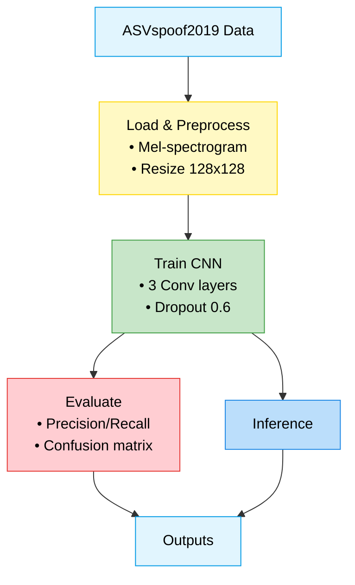

# Audio Spoofing Detection with ASVspoof2019

This project implements an audio spoofing detection system using the ASVspoof2019 Logical Access (LA) dataset. A Convolutional Neural Network (CNN) is trained to classify audio samples as `bonafide` (genuine) or `spoof` (fake) based on mel-spectrogram features. The model achieves 99% accuracy on a balanced development set, with excellent precision, recall, and F1-scores.

## Project Overview

The goal is to detect spoofed audio using the ASVspoof2019 dataset, which contains genuine and spoofed audio samples. The system preprocesses audio files to extract mel-spectrograms, trains a CNN with regularization and data augmentation, and evaluates performance using classification metrics and a confusion matrix. A testing script is included to classify individual audio files.

### Workflow Diagram

#### Features
- **Data Preprocessing**: Extracts 128x128 mel-spectrograms with normalization and augmentation (time stretching, pitch shifting, noise addition).
- **Model Architecture**: CNN with convolutional layers, batch normalization, dropout, and L2 regularization.
- **Training**: Uses early stopping and learning rate scheduling for optimal convergence.
- **Evaluation**: Reports precision, recall, F1-score, and confusion matrix for development and test sets.
- **Testing**: Supports classification of individual audio files using the trained model.

## Results (Development Set)
- **Development Set (1000 samples, 500 spoof, 500 bonafide)**:

| Metric          | Spoof | Bonafide | Overall |
|-----------------|-------|----------|---------|
| Accuracy        | -     | -        | 99%     |
| Precision       | 99%   | 100%     | -       |
| Recall          | 100%  | 99%      | -       |
| F1-Score        | 99%   | 99%      | -       |

### Confusion Matrix (500 spoof, 500 bonafide):

|                | Predicted Spoof | Predicted Bonafide |
|----------------|-----------------|--------------------|
| **Actual Spoof** | 498             | 2                  |
| **Actual Bonafide** | 5               | 495                |

